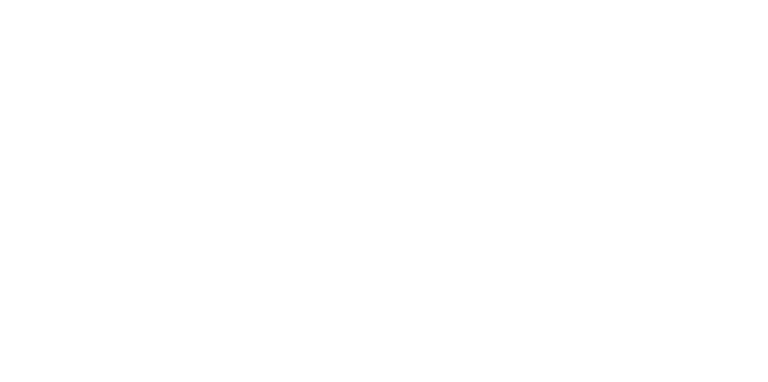

# <p align="center"></p>


*Have you been wondering how much sigma you are as a person? Worry no more! Introducing... the ultra based sigma-o-meter game!*

> [!WARNING]
> This game is made only for comedic purposes, do not take it seriously.

## Key Features

- No RNG involved!
  > All of the calculation is based on simple string calculation!
- ~~Not~~ Funny payload during calculation!
  > Based on Epic Calculator's payload during reveal!
- No data harvesting in any way!
  > This game is NOT receiving any personal data in ANY way.

## Getting Started

1. Install [aftman](https://github.com/LPGhatguy/aftman) if you don't have it already.
2. Install required toolchain and packages:

   ```bash
    aftman install
    wally install
   ```

3. Build the place to get started:

    ```bash
    rojo build -o "sigma.rbxlx"
    ```

4. Next, open `sigma.rbxlx` in Roblox Studio and start the Rojo server:

    ```bash
    rojo serve
    ```

> [!IMPORTANT]
> All sounds needs to be replaced, as Roblox do not allow audio to go public.

## Credits

- Song: xKore - Event Horizon
- Inspiration: Epic Calculator from GD and some [random Indonesian trend](https://check-your-khodam-new.netlify.app/)

## License

This place (excluding assets used in-game) is open under the MIT license. See <https://opensource.org/licenses/MIT> or LICENSE for details.
